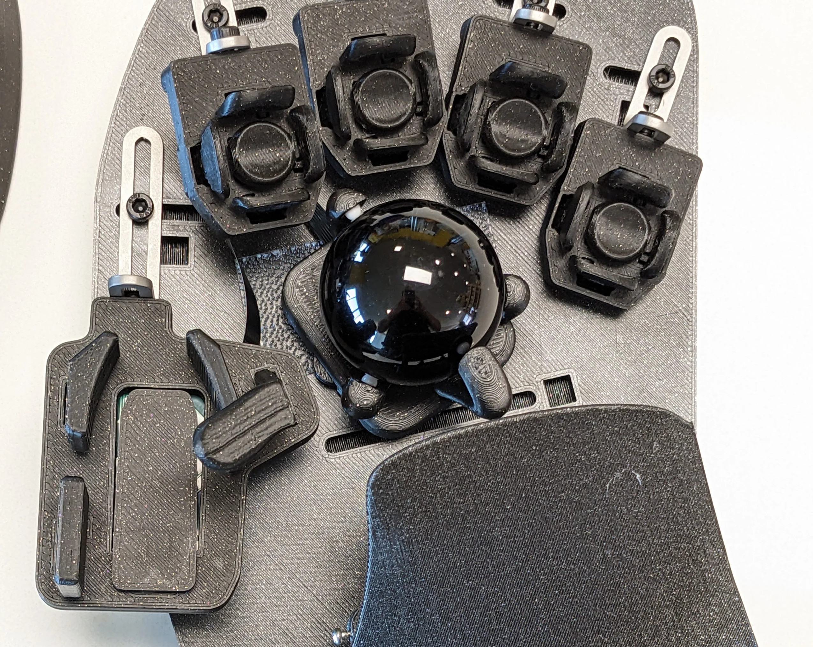
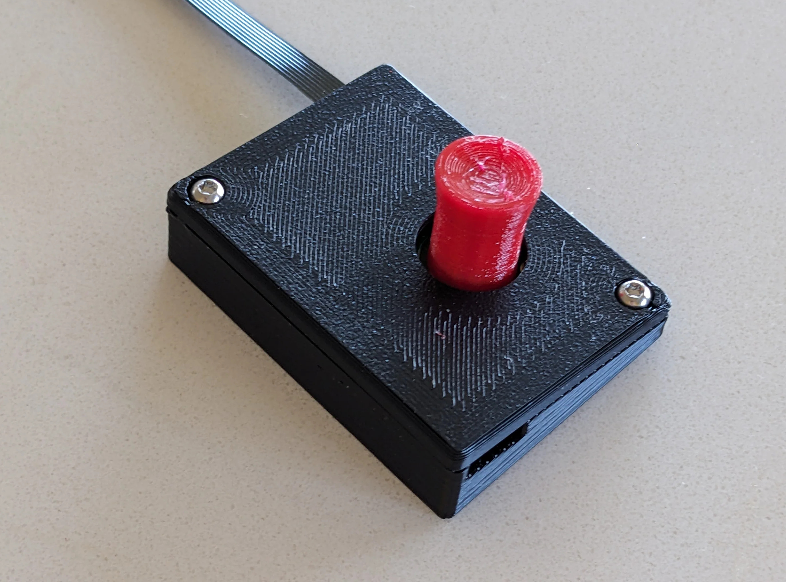

# Pointing Devices

* [Pointing Devices](#pointing-devices)
  * [Introduction](#introduction)
    * [Current Options](#current-options)
    * [Deprecated Options](#deprecated-options)
  * [Physical Configuration](#physical-configuration)
  * [Automouse Layer](#automouse-layer)
    * [Leaving The Automouse Layer](#leaving-the-automouse-layer)
    * [By Button Press](#by-button-press)
      * [By Timeout](#by-timeout)
    * [Editing The Automouse Layer](#editing-the-automouse-layer)
    * [Changing The Timeout](#changing-the-timeout)
  * [Adjusting Sensitivity](#adjusting-sensitivity)
    * [DPI](#dpi)
    * [Sniper Mode](#sniper-mode)
  * [Using A Pointing Device To Scroll](#using-a-pointing-device-to-scroll)
  * [Trackpoint Calibration/Drift](#trackpoint-calibrationdrift)
    * [Changing The Deadzone](#changing-the-deadzone)

## Introduction

The Svalboard supports up to one pointing device on each side.

### Current Options

* Trackball (pmw3389)


* Trackpoint


### Deprecated Options

* Trackball (pmw3360) -- Note that the function of this older trackball module
  does not differ at all; it only requires selecting the correct firmware.

## Physical Configuration

There are no strict requirements as to which hand any pointing device is placed
on, either absolutely or relative to the connection to the computer. However,
for optimal function, it is **recommended that a trackpoint, if present, be
placed on the half connected to the computer (master)**. Due to firmware
limitations, a trackpoint on the non-host (slave) hand will feel "laggy" and
seem to move the cursor with a slow update speed.

## Automouse Layer

When you move a pointing device, the Svalboard will automatically activate a
layer intended for mouse keys. This layer (by default) provides mouse buttons
on the south keys, with index for left-click, ring for right-click, and middle
for middle-click. Additionally, trackpoint calibration is provided on pinky
center.


### Leaving The Automouse Layer

### By Button Press

Hitting any key not on a short list of "mouse-related" keys will automatically
leave the automouse layer. By default, this means hitting most any other key on
the Svalboard that isn't mapped on the automouse layer, since the remaining keys
are "transparent" (and will thus press the key on the next-highest active
layer).

The following keys will *not* cause the automouse layer to deactivate:

* Mouse Buttons (`KC_BTN1`, `KC_BTN2`, `KC_BTN3`, `KC_BTN4`, `KC_BTN5`)
* Mouse Scrollwheel Up/Down/Right/Left (`KC_WH_U`, `KC_WH_D`, `KC_WH_R`,
  `KC_WH_L`)
* Modifiers (Shift, Control, Alt, etc.) (`KC_LSFT`, `KC_RSFT`, `KC_LCTL`,
  `KC_RCTL`, `KC_LALT`, `KC_RALT`, `KC_LGUI`, `KC_RGUI`)
* Scroll Toggle/Hold (`SV_LEFT_SCROLL_TOGGLE`, `SV_RIGHT_SCROLL_TOGGLE`,
  `SV_LEFT_SCROLL_HOLD`, `SV_RIGHT_SCROLL_HOLD`)
* "Sniper" Keys (`SV_SNIPER_2`, `SV_SNIPER_3`, `SV_SNIPER_5`)
* Trackpoint Calibration (`SV_RECALIBRATE_POINTER`)

#### By Timeout

There is also a timeout period for the automouse layer, that exits the layer if
no pointing device has moved within that period. By default, this timer is
infinite, meaning that it will never exit. See [Changing The
Timeout](#changing-the-timeout) for more info.

### Editing The Automouse Layer

To edit the buttons on this layer, simply edit the last layer (layer 15) in
Vial.

### Changing The Timeout

The automouse layer timer may be cycled through three settings: 300ms, 500ms,
and infinite (in that order, wrapping around). To cycle to the next timeout
setting, bind the key `Mouse Key Timer` (`SV_MH_CHANGE_TIMEOUTS`), found in the
`User` tab in Vial, somewhere on your layout, and press it. *The Svalboard
remembers this setting, so you won't need to do it every time you plug in your
keyboard.*


## Adjusting Sensitivity

### DPI

The DPI (sensitivity) of a left and right trackball may be adjusted
independently, using the left and right DPI +/- keys in the `User` tab of Vial
(`SV_LEFT_DPI_INC`, `SV_LEFT_DPI_DEC`, `SV_RIGHT_DPI_INC`, `SV_RIGHT_DPI_DEC`).
Bind these keys somewhere on your layout, and then press them to change the DPI
of the trackball.


Available DPIs are: 200, 400, 800, 1200, 1600, 2400. They do **not** wrap
around (i.e. pressing the button to increase DPI will never go from 2400 to
200).

*The Svalboard remembers this setting, so you won't need to do it every time you
plug in your keyboard.*

Please note that **the sensitivity of the trackpoint cannot be permanently
changed** and is unaffected by these keys.

### Sniper Mode

It is sometimes desirable to temporarily decrease the sensitivity of a pointing
device, if fine control is necessary in the moment.

To temporarily decrease the DPI (sensitivity) of all pointing devices, bind one
or more of the "sniper" keys in the `User` tab of Vial somewhere on your layout
(`SV_SNIPER_2`, `SV_SNIPER_3`, `SV_SNIPER_5`). While held down, these keys will
decrease the sensitivity of the pointing device by 2x, 3x, or 5x. Note that the
effects of these keys combine, e.g. holding both `Sniper 2x` and `Sniper 5x`
results in a 10-fold reduction in sensitivity. As soon as the keys are released,
sensitivity returns to normal.

Note that **unlike DPI, sniper mode works with the trackpoint.**

## Using A Pointing Device To Scroll

One popular use of dual pointing devices is to use the left hand to scroll and
the right to move the cursor.

Either (or both) pointing devices may be set to act as a scrollwheel instead of
moving the cursor. Bind one or more of the left/right scroll toggle/hold keys in
the `User` tab of Vial (`SV_LEFT_SCROLL_TOGGLE`, `SV_RIGHT_SCROLL_TOGGLE`,
`SV_LEFT_SCROLL_HOLD`, `SV_RIGHT_SCROLL_HOLD`) somewhere on your layout. These
keys may be used to either permanently (for toggle) or temporarily (for hold)
make a pointing device scroll instead of moving the cursor.


*The Svalboard remembers this setting, so you won't need to do it every time you
plug in your keyboard.*

## Trackpoint Calibration/Drift

In some circumstances, a trackpoint module may cause a tiny amount of cursor
drift. This is most often experienced with large temperature fluctuations. If
you notice your cursor drifting, you may press the "Fix Drift" key
(`SV_RECALIBRATE_POINTER`) to recalibrate the trackpoint's "zero" state. This
key is available on the default automouse layer as left/right pinky center, or
may be bound from the `User` tab in Vial.


**Make certain you are not touching the trackpoint while you calibrate it.**

### Changing The Deadzone

If you find that drift occurs very often even with recalibration, you may need
to increase the deadzone of the trackpoint. This will require editing the code
in [trackpoint.c](../trackpoint/trackpoint.c) and recompiling the firmware.

The value on line 73:

```c
 PS2_MOUSE_SEND(0x15, "pts: 0x15");  // Experiment with this if it isn't enough.
```

can be adjusted upwards slightly, for instance to `0x16` or `0x17` (it is
hexadecimal). **Make certain to adjust both instances of `0x15`.**

If you're not comfortable with this process, ask for help in [the
Discord](https://svalboard.com/discord) or find more options at
[https://svalboard.com/pages/support](https://svalboard.com/pages/support).
